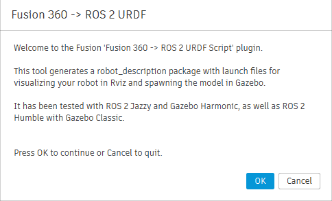
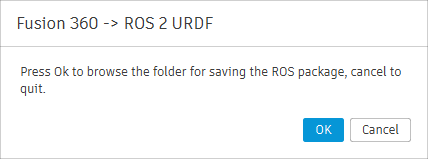
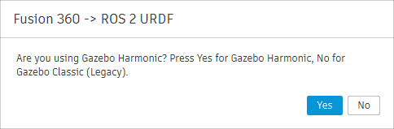
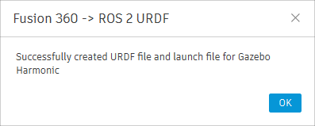

# Autodesk Fusion 360 to URDF for ROS 2

## Table of Contents
- [Introduction](#introduction)
- [Description](#description)
- [Installation](#installation)
- [Important Design Practices](#important-design-practices)
- [Usage](#usage)
  - [Start Modeling a Sample Robot](#start-modeling-a-sample-robot)
  - [Converting Fusion 360 Model to URDF for ROS 2](#converting-fusion-360-model-to-urdf-for-ros-2)
  - [Visualizing Robot in Rviz](#visualizing-robot-in-rviz)
  - [Launching Robot Simulation in Gazebo Sim](#launching-robot-simulation-in-gazebo-sim)
- [Contributing](#contributing)
- [License](#license)
- [Credits](#credits)
- [Conclusion](#conclusion)

## Introduction
The "Autodesk Fusion 360 to URDF for ROS 2" project aims to bridge the gap between CAD modeling and robotic simulation. 
This tool allows users to convert their Autodesk Fusion 360 models into Unified Robot Description Format (URDF) files, which can be used in ROS 2 (Robot Operating System) for visualization and simulation.
 
By providing a seamless workflow from design to simulation, this project enables roboticists and engineers to visualize, test, and iterate on their robot designs more efficiently. Whether you are developing a new robot or refining an existing one, this tool simplifies the process of integrating your CAD models into the ROS 2 ecosystem.

## Description
This project is an Add-In script for Autodesk Fusion 360 to export 3D models to a robot description package which contains URDF, Mesh files (.stl),
launch files for visualization and simulation etc. to make it work with ROS 2 (Tested in Jazzy and Humble)

Here are the list of features of the project

### Features
- **Seamless Conversion to URDF**: Easily convert Autodesk Fusion 360 models into URDF files compatible with ROS 2.
- **Visualization**: Visualize your robot models in Rviz using the launch file automatically created after conversion.
- **Simulation**: Launch and test your robot simulations in ROS 2 Humble with Gazebo Classic and ROS 2 Jazzy with latest Gazebo Sim.
- **User-Friendly Workflow**: Provides a straightforward workflow from CAD design to robotic simulation.
- **Sample Models**: Includes instructions and examples for modeling sample robots.
- **Customization**: Supports customization of URDF files to match specific robot configurations and requirements.
- **Documentation**: Comprehensive documentation to guide users through installation, usage, and troubleshooting.

By leveraging this tool, users can bridge the gap between CAD modeling and robotic simulation, making it easier to develop and refine robotic systems within the ROS 2 ecosystem.

### System Requirements

Here is the platform we used to test this plugin.

- **Operating System**: Windows 11 x64, macOS
- **Software**: Autodesk Fusion 360 2.0.20981 x86_64

## Installation

Here are the steps to install the script in Fusion 360

* **Step 1**: Download and [install Autodesk Fusion 360 in your computer](https://www.autodesk.com/in/education/edu-software/fusion)

* **Step 2**: Download repository as Zip file and extract the file to a location.

* **Step 3**: Open Fusion 360, and press *Shift+S*, this will show the Scripts and Add-Ins like shown below

<p align="center">
  
</p>

Click on the *Green +* icon and browse the extracted script folder as shown below. 
The folder we have to browse is *Fusion_URDF_Exporter_ROS2*. 

<p align="center">
  
</p>

After selecting the folder, it will show the new script as *Fusion_URDF_Exporter_ROS2* under *My Scripts*.

* **Step 4**: Press Shift+S to see the *Scripts and Add-Ins Window* (Utilities -> ADD-INS)

<p align="center">
  
</p>

The installation is successfull if you are seeing the script under *My Scripts*.

After installing the script, let's dive into some important design practices we have to do to make the script work.

## Important Design Practices 

Here’s a list of things you have to consider before start modelling the robot to make it work with the script:

- **Define all robot links as Components Definitions**:
  - Ensure all robot "links" are defined as components in your model.
  - Models like the SpotMini robot need a properly defined `base_link`.

- **Joint Definition**:
  - Parent links must be set as **Component2** when defining joints, not as Component1.
  - Errors like `KeyError: base_link__1` occur if `base_link` is incorrectly assigned.

- **Component Requirements**:
  - Components should contain **only bodies**—nested components are not supported.
  - Avoid components that have other components inside them.

- **URDF Export Issues**:
  - Abnormal URDF exports without error messages usually indicate joint problems—redefine the joints and try again.
  - Supported joint types: **Rigid**, **Slider**, and **Revolute**.

- **Complex Kinematic Loops and Spherical Joints**:
  - Avoid using Fusion 360’s inbuilt joint editor for positioning joints in complex kinematic loops.
  - For spherical joints:
    - Export as revolute joints and later modify them to spherical joints in the URDF.
    - This works only if the target parser/engine supports spherical joints (e.g., PyBullet).

- **Joint Alignment**:
  - Misalignments can occur during initial joint positioning in Fusion.
  - Manual adjustments can cause cascading issues with visual and collision properties.

- **Export Tips**:
  - Turn off "Capture design history" before exporting.
  - Use distinct names for components and save individual components in separate folders to prevent issues.

- **Specific Issues**:
  - Copy-paste actions can lead to problems; prefer "copy-paste new" for components.
  - Preplan component placement to avoid assembly issues.

These points cover the critical limitations and considerations when using the script for exporting URDF files from Fusion 360 models.


## Usage
### Start Modeling a Sample Robot
Instructions on how to start modeling a sample robot using Autodesk Fusion 360.

### Converting Fusion 360 Model to URDF for ROS 2
After completing the CAD model in Fusion 360, Press Shift+S for opening the script box and select the *Fusion_URDF_Exporter_ROS2* script from My Scritpts. 

It will show a welcome screen showing the basic information about the script and ask the user to proceed with conversion or not.

<p align="center">
  
</p>

After pressing the *Ok* button, it will ask for the folder in which the ROS 2 package has to be created.

<p align="center">
  
</p>

When we press the *Ok* button it will show the browse dialog and we can select a folder. After selecting the folder 
select which Gazebo version we have to go for. Gazebo Harmonic or Classic. Based on the input, it will create the launch file for that. 
<p align="center">
  
</p>

Once you select the version, it will show the final message whether it is successful or not.

<p align="center">
  
</p>

After creating the ROS 2 package for your robot, you can copy the ROS 2 package to your ROS 2 workspace.
If you are working in Windows 11, you can work on ROS 2 using WSL or using a virtual machine. Othervice you can reboot and 
select Ubuntu 22.04 for ROS 2 Humble/Ubuntu 24.04 for ROS 2 Jazzy.

For example, if you use ros2bot model from demos folder and convert to ROS 2 package, you will get a package named
*ros2bot_description*. The package is also put in the demos folder for your reference. Copy to your ROS 2 workspace

For eg. Let's ros2_ws is the name of the workspace and you copied the package to the *src* folder of the workspace.

```
cd ~/ros2_ws
colcon build
```
After building the package, do sourcing of the workspace

```
source install/setup.bash
```
After doing the sourcing of the workspace, we can do the visualization and simulation of the robot.
### Visualizing Robot in Rviz
Here is the command to visualize the robot in Rviz

```
ros2 launch ros2bot_description display.launch.py
```
This will be showing Rviz along with *joint_state_publisher_gui* node.

<p align="center">
  
</p>

### Launching Robot Simulation in Gazebo Sim
Here is the command to spawn the robot in Gazebo. The same command can be use for Gazebo Classic and Gazebo Sim.

```
ros2 launch ros2bot_description gazebo.launch.py
```
**Note**: The URDF doesn't have any Gazebo plugin or ROS 2 controllers configurations. We have to edit the package to include all the 
plugins of Gazebo.

<p align="center">
  
</p>


## Contributing

Always welcome bug fixes, new features etc.

* **Create a Pull Request**: Ceate a pull request from your forked repository. Provide a clear description of the changes and any relevant information. 


## License

This project is licensed under the terms of the [MIT License](LICENSE).


## Credits
This project is an updation of repositories from [syuntoku14](https://github.com/syuntoku14/fusion2urdf) and [dheena2k2](https://github.com/dheena2k2/fusion2urdf-ros2). 


## Conclusion

In conclusion, the "Autodesk Fusion 360 to URDF for ROS 2" project provides a powerful and user-friendly tool for roboticists and engineers. By streamlining the process of converting CAD models to URDF files, this tool enhances the efficiency of robot design, visualization, and simulation within the ROS 2 ecosystem. We hope this project will significantly contribute to your robotic development efforts and look forward to your feedback and contributions.