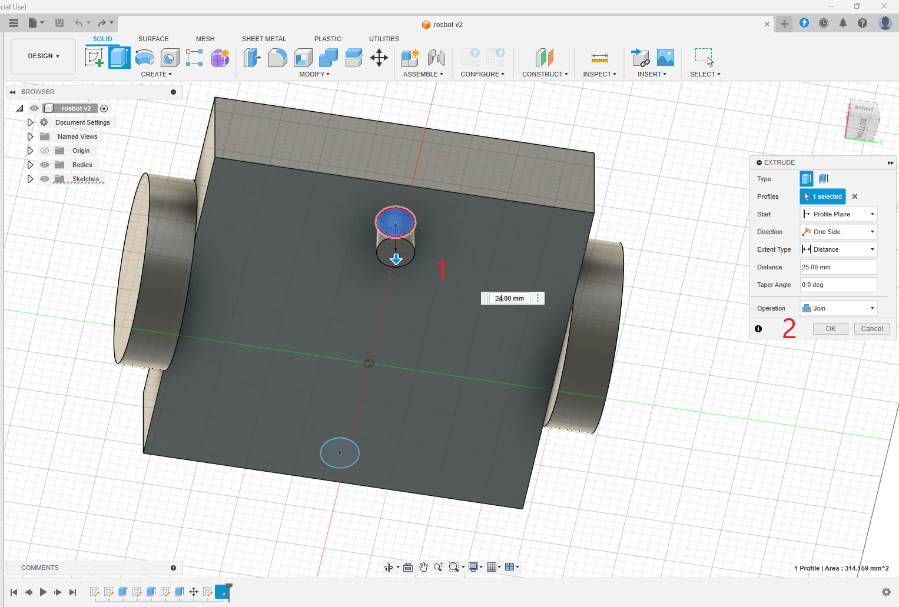

# Autodesk Fusion 360 to URDF for ROS 2

## Table of Contents
- [Introduction](#introduction)
- [Description](#description)
  - [Features](#features)
  - [System Requirements](#system-requirements)
- [Installation](#installation)
- [Important Design Practices](#important-design-practices)
- [Usage](#usage)
  - [Start Modeling a Sample Robot](#start-modeling-a-sample-robot)
    - [1) Setting the Design plane for export](#1-setting-the-design-plane-for-export)
    - [2) Sketching Robot Base](#2-sketching-robot-base)
    - [3) Adding Wheels to the Robot base](#3-adding-wheels-to-the-robot-base)
    - [4) Moving Robot to Ground Level](#4-moving-robot-to-ground-level)
    - [5) Adding Caster Wheels to the Base of the robot](#5-adding-caster-wheels-to-the-base-of-the-robot)
    - [6) Adding Lidar base and lidar to Robot](#6-adding-lidar-base-and-lidar-to-robot)
    - [7) Adding material type and color](#7-adding-material-type-and-color)
    - [8) Converting bodies to Components](#8-converting-bodies-to-components)
    - [9) Assigning Joints to Wheels and Joints](#9-assigning-joints-to-wheels-and-joints)
  - [Converting Fusion 360 Model to URDF for ROS 2](#converting-fusion-360-model-to-urdf-for-ros-2)
  - [Building ROS 2 Package](#building-ros-2-package)
  - [Visualizing Robot in Rviz](#visualizing-robot-in-rviz)
  - [Launching Robot Simulation in Gazebo Sim](#launching-robot-simulation-in-gazebo-sim)
  - [Editing the ROS 2 package for plugins](#editing-the-ros-2-package-for-plugins)
  - [Moving the robot in Gazebo Sim and ROS 2](#moving-the-robot-in-gazebo-sim-and-ros-2)
- [Contributing](#contributing)
- [Known Issues and limitations](#known-issues-and-limitations)
- [License](#license)
- [Credits](#credits)
- [Conclusion](#conclusion)

## Introduction
The "Autodesk Fusion 360 to URDF for ROS 2" project aims to bridge the gap between CAD modeling and robotic simulation. 
This tool allows users to convert their Autodesk Fusion 360 models into Unified Robot Description Format (URDF) files, which can be used in ROS 2 (Robot Operating System) for visualization and simulation.
 
By providing a seamless workflow from design to simulation, this project enables roboticists and engineers to visualize, test, and iterate on their robot designs more efficiently. Whether you are developing a new robot or refining an existing one, this tool simplifies the process of integrating your CAD models into the ROS 2 ecosystem.

## Description
This project is an Add-In script for Autodesk Fusion 360 to export 3D models to a robot description package which contains URDF, Mesh files (.stl),
launch files for visualization and simulation etc. to make it work with ROS 2 (Tested in Jazzy and Humble)

Here are the list of features of the project

### Features
- **Seamless Conversion to URDF**: Easily convert Autodesk Fusion 360 models into URDF files compatible with ROS 2.
- **Visualization**: Visualize your robot models in Rviz using the launch file automatically created after conversion.
- **Simulation**: Launch and test your robot simulations in ROS 2 Humble with Gazebo Classic and ROS 2 Jazzy with latest Gazebo Sim.
- **User-Friendly Workflow**: Provides a straightforward workflow from CAD design to robotic simulation.
- **Sample Models**: Includes instructions and examples for modeling sample robots.
- **Customization**: Supports customization of URDF files to match specific robot configurations and requirements.
- **Documentation**: Comprehensive documentation to guide users through installation, usage, and troubleshooting.

By leveraging this tool, users can bridge the gap between CAD modeling and robotic simulation, making it easier to develop and refine robotic systems within the ROS 2 ecosystem.

### System Requirements

Here is the platform we used to test this plugin.

- **Operating System**: Windows 11 x64, macOS
- **Software**: Autodesk Fusion 360 2.0.20981 x86_64

## Installation

Here are the steps to install the script in Fusion 360

* **Step 1**: Download and <a href="https://www.autodesk.com/in/education/edu-software/fusion" target="_blank">install Autodesk Fusion 360 in your computer</a>

* **Step 2**: Download repository as Zip file and extract the file to a location.

* **Step 3**: Open Fusion 360, and press *Shift+S*, this will show the Scripts and Add-Ins like shown below

<p align="center">
  
</p>

Click on the *Green +* icon and browse the extracted script folder as shown below. 
The folder we have to browse is *Fusion_URDF_Exporter_ROS2*. 

<p align="center">
  
</p>

After selecting the folder, it will show the new script as *Fusion_URDF_Exporter_ROS2* under *My Scripts*.

* **Step 4**: Press Shift+S to see the *Scripts and Add-Ins Window* (Utilities -> ADD-INS)

<p align="center">
  
</p>

The installation is successfull if you are seeing the script under *My Scripts*.

After installing the script, let's dive into some important design practices we have to do to make the script work.

## Important Design Practices 

Here’s a list of things you have to consider before start modelling the robot to make it work with the script:

* **Correct the Fusion 360 coordinate system**: We have to keep the right-hand-rule for the cartesian coordinate system for designing robot model to properly work with the robot model in ROS 2 URDF. 

This section describes the coordinate system used in the project.


1) **Index Finger (X-axis)**: Represents the positive direction of the X-axis; the robot model should always point to the +X direction in Fusion 360. This axis has the **length** of the robot.

2) **Thumb (Z-axis)**: Represents the positive direction of the Z-axis. This axis has the **height** of the robot.

3) **Middle Finger (Y-axis)**: Represents the positive direction of the Y-axis. This axis is the robot's **width**.

We need to follow this coordinate system to visualize and spawn the model correctly in Rviz and Gazebo in ROS 2.

<p align="center">
  
</p>

In Fusion 360, the robot model and coordinate system looks like this

<p align="center">
  
</p>

- **Define all robot links as Components Definitions**:
  - Ensure all robot "links" are defined as components in your model.
  - The root link has to be defined in the name of `base_link`.
  - Errors like `KeyError: base_link__1` occur if `base_link` is incorrectly assigned.

- **Joint Definition**:
  - Parent links must be set as **Component2** when defining joints, not as **Component1**.

- **Component Requirements**:
  - Components should contain **only bodies**—nested components are not supported.
  - Avoid components that have other components inside them.

Here are the components and their bodies in the ros2bot from the demos

<p align="center">
  
</p>


- **URDF Export Issues**:
  - Abnormal URDF exports without error messages usually indicate joint problems—redefine the joints and try again.
  - Supported joint types: **Rigid**, **Slider**, and **Revolute**.

- **Complex Kinematic Loops and Spherical Joints**:
  - Avoid using Fusion 360’s inbuilt joint editor for positioning joints in complex kinematic loops.
  - For spherical joints:
    - Export as revolute joints and later modify them to spherical joints in the URDF.
    - This works only if the target parser/engine supports spherical joints (e.g., PyBullet).

- **Joint Alignment**:
  - Misalignments can occur during initial joint positioning in Fusion.
  - Manual adjustments can cause cascading issues with visual and collision properties.

- **Export Tips**:
  - Turn off "Capture design history" before exporting.
  - Use distinct names for components and save individual components in separate folders to prevent issues.

- **Specific Issues**:
  - Copy-paste actions can lead to problems; prefer "copy-paste new" for components.
  - Preplan component placement to avoid assembly issues.

These points cover the critical limitations and considerations when using the script for exporting URDF files from Fusion 360 models.


## Usage
### Start Modeling a Sample Robot
Here are the instructions on how to start modeling a sample robot using Autodesk Fusion 360.

<p align="center">
  
</p>

### Introduction to Fusion 360 modeling for ROS 2

In this document, we can see how to model a 2-wheel drive robot in Fusion 360 in order to export into ROS 2 URDF.

Here is the robot model we are going to design.

<p align="center">
  
</p>

Here are the important steps in the modeling of this robot

### 1) Setting the Design plane for export

We must follow the *right-hand rule* for setting the plane before starting the modeling. 

If we follow this, the exported URDF model will face the *+X-axis*. 
This is the axis we need when we visualize robots in ROS 2.

Here is the design plan we have to set before starting the design.

<p align="center">
  
</p>

### 2) Sketching Robot Base

After setting the plane, we can start sketching the robot's base. After sketching the plane, we can extrude the plane to create the box.

Select Menu, *SOLID -> Create Sketch*. After pressing this option, it will ask which plane we have to draw the sketch. 

It will show different planes, and choosing the exact plane we want may be confusing. 

We can use the *Shift+ Mouse Center button* to orbit the 3D view to select the same plane we have seen in the first step.

<p align="center">
  
</p>


After selecting the plane, orbit the 3D scene to make the +X axis always front. 

Now, you can select the *2-point rectangle* from the *SKETCH*. From *Sketch-palette* window on right side, choose *center rectange* option as shown below. 
This option, can draw a rectangle from a center point. 

<p align="center">
  
</p>


After selecting the plane, orbit the 3D scene to make the +X axis always front. 

Now, you can select the *2-point rectangle* from the *SKETCH*. From the *Sketch-palette* window on the right side, choose the *center rectangle* option as shown below. 
This option allows you to draw a rectangle from a center point.


<p align="center">
  
</p>

Press the *Tab* key to switch between the square dimensions and enter the dimensions. 
You can give **200 mm** as the width and length for the base_link.

<p align="center">
  
</p>

After drawing the correct dimensions, you can click the *Finish sketch* button on the right side of the top to complete the sketch.

After completing the sketch, you can click on the top to select the sketch's top area.

<p align="center">
  
</p>

Now press the key * 'Q' (Menu Solid ->Modify->Press Pull)* to extrude the sketch surface to make a box. Once you press the *'Q'* button, you will see an arrow key that will extrude the sketch to some height. You can give a value of 50 mm as the height.

<p align="center">
  
</p>

After giving the height as 50 mm, select the *Operation* option from the *Extrude window* on the right side. The *Operation* option we must select is **New Body**. After this option, we can press Ok.

### 3) Adding Wheels to the Robot base

We can add wheels after making the robot's main chassis/base_link.
We must add two active and two passive caster wheels to the chassis.

The following image shows the *Z-X plane*, which shows the side of the chassis in which we have to add wheels.

<p align="center">
  
</p>

To create wheels, we can start a sketch and extrude it like we did for the chassis.
In the following image, we can see that you have chosen the *Sketch option* and chose a circle with 
center diameter circle, and then choose the center of the chassis, as shown in the following image.
Give a diameter of **100 mm** and press *Finish the sketch*.

<p align="center">
  
</p>

Now, you can click on the wheel sketch. You may have to press the *Shift* key to
select each segment of the wheel.

Now, press *'Q'* to extrude it and make the distance *25mm* the thickness of the wheel.

The important thing to note is that we have to make the wheel a new body in the operation option in extrude.
This makes a new wheel a new body.


<p align="center">
  
</p>

We can create the next wheel with the same process we have done with the first wheel.

### 4) Moving Robot to Ground Level

After creating 2 wheels and the base_link, we have 3 independent bodies. 
The next step is to move the entire robot above the design plane. You can compute the distance by measuring it and 
moving the robot using the *Move button*. Make sure you have selected all the 3 bodies before you move. You can roughly put *25 mm* as the *Z value* in the *Move window* to lift the robot from the design floor.

You can find the robot's position in the following image.

<p align="center">
  
</p>

Here is the side view of the lifted robot.

<p align="center">
  
</p>

### 5) Adding Caster Wheels to the Base of the robot

After lifting the robot, the next step is to add caster wheels to the robot.
We have to add a caster wheel on the front and back of the robot.
As we already discussed, casters are passive wheels that help the robot balance and distribute weight.

To add two casters, we must create 2 small cylinders on the **bottom** side of the chassis. 
You can put the center of the circle *25 mm* from both sides and have a diameter of *24 mm*.

To create a cylinder, we can extrude a circle sketch.
The length of the extrude can be *24 mm*, a few mm less than the robot's height from the ground.

<p align="center">
  
</p>

Here is how we extrude the caster wheel. Make sure the Operation is a **Joint**, NOT a *New body*. The caster is a part of the chassis.

<p align="center">
  
</p>

After creating the cylinder on both sides, we can make the bottom face of the cylinder, spherical.

Select the face of the cylinder, and Press *'F'*  or *(Menu Surface->Modify->Fillet)*, and using a mouse, we can create a spherical face from the flat surface.

<p align="center">
  
</p>

We can do the same operation for both the caster wheels and the final output will look like the following image. 

<p align="center">
  
</p>

### 6) Adding Lidar base and lidar to Robot

Once the caster design is completed, we can add a lidar to the front of the robot. We have to build a fixed platform first.
After putting the base, we can create a cylinder shape to replicate a lidar, as shown below.

You can draw a centered rectangle sketch with 70 mm(length) x 60 mm(width) and an extrude height of 45 mm (height). 
You can put the center of the box 50 mm from the front of the robot.

<p align="center">
  
</p>

After creating the box, we can make a circle (29.5 mm radius) on the top and create a cylinder by extruding the circle by 20 mm.
Make sure you are creating a new body when you extrude the object.

After creating all bodies, you can rename them into meaningful names like the one below.

<p align="center">
  
</p>

The chassis has to be named as base_link, which is mandatory, and you can name 
left and right wheels have the same name, and you can also add a name to the lidar.

### 7) Adding material type and color

After creating the model, we may go to each *Body*, right-click on each body, and choose *Physical materials*.

The *Physical material* can assign each link with material properties.

<p align="center">
  
</p>

Search for ABS plastic for the base link. Just click and drag the material to the link to apply the material.
Choose material *Rubber black* for wheels and laminate blue for lidar.

<p align="center">
  
</p>


### 8) Converting bodies to Components

After adding the material's properties, we must convert the individual bodies to Components.
The conversion from *bodies* to *components* is easy. 

Here is how we can do it. 

Click on the *Bodies* option and choose the option called *Components* to *Bodies*.
As shown below. Bodies are single shapes within a component. A component can hold multiple bodies.
To export to URDF, we need to make individual *components* of the robot.

<p align="center">
  
</p>

### 9) Assigning Joints to Wheels and Joints

After assigning the materials, we must assign the joints for connecting 
wheels to *base_link*. We also have to attach the lidar link to the base_link. 

This is the most 
important step in the modeling. Without assigning joints, the robot can't able to move.

Here are the steps to assign a joint in Fusion 360. We can first check how to create a joint between wheels and *base_link*.

First, we must hide the *base_link* component and press *'J'* *(Menu Solid->Assemble->Joint)* to create a new joint.
After invoking the *joint* option, we must provide the *components* (link) in the joint.

We can see how to create a revolute joint between the base_link and the two wheels. 

To create a joint, we need two 2 components: the first component should be the wheel, and the second will be the base_link.

We have to hide the base_link first and click on the center of the wheel, which is attached to the base_link.

<p align="center">
  
</p>


After clicking on the center of the wheel, we can see a coordinate on the wheel. Next, we can hide the wheels and attach the frame in the base_link.
<p align="center">
  
</p>

Once it is done, you can press the *Motion Tab* in the *Edit Joint option* to select the type of joint.

<p align="center">
  
</p>

We need the revolute joint for the wheels, so select it, and you can preview the motion of the joint as well.

After setting one joint, you can do the same for the next wheel as well.

For the lidar link, we have to create a rigid link between the lidar and base_link.

In the Browser section of Fusion 360, go to *Joints* and rename each joint as right_wheel_joint, left_wheel_joint and lidar_joint. 

Congratulations, you have done with the modeling part of the robot. Now, we can export the model to URDF.

<p align="center">
  
</p>


### Converting Fusion 360 Model to URDF for ROS 2
After completing the CAD model in Fusion 360, Press Shift+S for opening the script box and select the *Fusion_URDF_Exporter_ROS2* script from My Scripts. 

<p align="center">
  
</p>


* **Step 1**: It will show a welcome screen showing the basic information about the script and ask the user to proceed with conversion or not.

* **Step 2**: After pressing the *Ok* button, it will ask for the folder in which the ROS 2 package has to be created.
 

* **Step 3**: When we press the *Ok* button it will show the browse dialog and we can select a folder.  

* **Step 4**: After selecting the folder select which Gazebo version we have to go for. Here are the two option that is current available (Gazebo Harmonic or Classic). Based on the input, it will create the launch file for that. 

* **Step 5**: Once you select the Gazebo version, it will show the final message whether it is successful or not. 
It will create the ROS 2 description package after this conversion.

### Building ROS 2 Package

After creating the ROS 2 package for your robot, you can copy the ROS 2 package to your ROS 2 workspace.
If you are working in Windows 11, you can work on ROS 2 using WSL or using a virtual machine. Othervice you can reboot and 
select Ubuntu 22.04 for ROS 2 Humble/Ubuntu 24.04 for ROS 2 Jazzy.

For example, if you use *ros2bot* model from demos folder and convert to ROS 2 package, you will get a package named
*ros2bot_description*. The package is also put in the demos folder for your reference. Copy to your ROS 2 workspace

For eg. Let's ros2_ws is the name of the workspace and you copied the package to the *src* folder of the workspace.

```
cd ~/ros2_ws
colcon build
```
After building the package, do sourcing of the workspace

```
source install/setup.bash
```
After doing the sourcing of the workspace, we can do the visualization and simulation of the robot.
### Visualizing Robot in Rviz
Here is the command to visualize the robot in Rviz

```
ros2 launch ros2bot_description display.launch.py
```
This will be showing Rviz along with *joint_state_publisher_gui* node.

<p align="center">
  
</p>

### Launching Robot Simulation in Gazebo Sim
Here is the command to spawn the robot in Gazebo. The same command can be use for Gazebo Classic and Gazebo Sim.

```
ros2 launch ros2bot_description gazebo.launch.py
```
**Note**: The URDF doesn't have any Gazebo plugin or ROS 2 controllers configurations. We have to edit the package to include all the 
plugins of Gazebo.

<p align="center">
  
</p>

**Note: If you are using Gazebo Sim you can visualize the center of mass, collision and inertia by finding the robot name in the **Entity Tree** and right click on it. You can find an option called **View** and can able to view all these parameters.**

Here is the screenshot of these parameter of ros2bot from the demos.

<p align="center">
  
</p>


### Editing the ROS 2 package for plugins

The package which is created by the plugin is incomplete. It can visualize and simulate the robot, but there are no Gazebo plugins or ROS 2 controller attached. These plugins are controllers help the robot to move and simulate various sensors. The plugin can't able to do that because each robot is unique right. 

We can take the generated package as a template in which we can modify it and add all the neccessary plugins.

Here is an example ROS 2 package for rosbot.

You can find the generated package of rosbot from [here](demos/rosbot/generated_pkg/rosbot_description/)

Here are the modification we have to do to make the robot live.

#### 1) Correction of xacro file (if the motion is different)

After visualizing and testing the joints of robot using *joint_state_publisher_gui*, you may notice some joints moving in opposite direction than we expected. 

In the case of rosbot, both wheel should rotate in clock-vice direction for the positive value of joint. If you are not getting it, we have to goto generated xacro file. For example, in this case, we can go to [rosbot.xacro](demos/rosbot/generated_pkg/rosbot_description/urdf/rosbot.xacro) and change the *right_wheel_joint* axis rotation of Y-axis. It is negative now, we have to remove the negative sign.

```
<joint name="right_wheel_joint" type="continuous">
  <origin xyz="0.0 -0.1 0.05" rpy="0 0 0"/>
  <parent link="base_link"/>
  <child link="right_wheel_1"/>
  <axis xyz="0.0 -1.0 0.0"/>
</joint>
```
It should be like this.

```
<joint name="right_wheel_joint" type="continuous">
  <origin xyz="0.0 -0.1 0.05" rpy="0 0 0"/>
  <parent link="base_link"/>
  <child link="right_wheel_1"/>
  <axis xyz="0.0 1.0 0.0"/>
</joint>
```

You can find the final xacro from [here](demos/rosbot/modified_pkg/rosbot_description/urdf/rosbot.xacro)

**Note**: The change in URDF can be different for each robots. This change is typical for this robot. After changing the axis, make sure everything works good.


#### 2) Add Gazebo Sim Plugins / ROS 2 controllers

After making the changes in xacro, add the neccessary Gazebo plugins and ROS 2 controllers in the URDF.

If you are planning to add Gazebo Sim/Gazebo Classic plugins, you can add it in the *rosbot.gazebo* file. In the rosbot example, you can find the final *rosbot.gazebo* from this [link](demos/rosbot/modified_pkg/rosbot_description/urdf/rosbot.gazebo). We have added *differential drive plugin*, *lidar*, *joint state plugin* in the URDF.

Here are the extra addon you typically need for a differential drive robot with a lidar for Gazebo Sim (Prev Ignition Gazebo).
```

  <gazebo>  

        <plugin filename="gz-sim-sensors-system" name="gz::sim::systems::Sensors">
            <render_engine>ogre2</render_engine>
        </plugin>


        <plugin filename="gz-sim-joint-state-publisher-system" name="gz::sim::systems::JointStatePublisher">
        <topic>/joint_states</topic>      
        </plugin>


      <plugin
        filename="gz-sim-diff-drive-system"
        name="gz::sim::systems::DiffDrive">
        <left_joint>left_wheel_joint</left_joint>
        <right_joint>right_wheel_joint</right_joint>
        <wheel_separation>0.2</wheel_separation>
        <wheel_radius>0.05</wheel_radius>
        <odom_publish_frequency>30</odom_publish_frequency>
        <topic>/cmd_vel</topic>  
        <tf_topic>/tf</tf_topic>        
        <frame_id>odom</frame_id>     
        <odom_topic>odom</odom_topic>             
        <child_frame_id>base_link</child_frame_id>            

</plugin>
</gazebo>


<gazebo reference="lidar_1">
        <sensor name='gpu_lidar' type='gpu_lidar'>
          <pose>0 0 0 0 0 0</pose>
          <topic>scan</topic>
          <gz_frame_id>lidar_1</gz_frame_id>          
          <update_rate>10</update_rate>
          <lidar>
            <scan>
              <horizontal>
                <samples>640</samples>
                <resolution>1</resolution>
                <min_angle>-1.396263</min_angle>
                <max_angle>1.396263</max_angle>
              </horizontal>
              <vertical>
                <samples>1</samples>
                <resolution>1</resolution>
                <min_angle>0.0</min_angle>
                <max_angle>0.0</max_angle>
              </vertical>
            </scan>
            <range>
              <min>0.08</min>
              <max>10.0</max>
              <resolution>0.01</resolution>
            </range>
          </lidar>
          <visualize>true</visualize>
        </sensor>
 </gazebo>

```

If you are working on Gazebo Classic, you can find the similar
plugins from this [link](https://classic.gazebosim.org/tutorials?tut=ros_gzplugins)

Note: If you want to interface ROS 2 control with Gazebo Sim, you can refer book *Mastering ROS 2* book [code repo](https://github.com/PacktPublishing/Mastering-ROS-2/tree/main/Chapter05).


#### 3) Update Gazebo-ROS 2 bridge topics

After updating the plugins, if you run the gazebo simulation, you can find the Gazebo topics are showing not the ROS 2 topics.

You can find the Gazebo topics using following command

```
gz topic -l
```

To bridge the Gazebo topics to ROS 2, we can add the bridge topics in the *config/ros_gz_bridge_gazebo.yaml*. These bridge topics can bridge topics from Gazeob<->ROS 2.

Here is the final [bridge yaml file](demos/rosbot/modified_pkg/rosbot_description/config/ros_gz_bridge_gazebo.yaml) for this example.

Here are the addons in the generated config file

```
- ros_topic_name: "/scan"
  gz_topic_name: "/scan"
  ros_type_name: "sensor_msgs/msg/LaserScan"
  gz_type_name: "gz.msgs.LaserScan"
  direction: GZ_TO_ROS 
  
- ros_topic_name: "/tf"
  gz_topic_name: "/tf"
  ros_type_name: "tf2_msgs/msg/TFMessage"
  gz_type_name: "gz.msgs.Pose_V"
  direction: GZ_TO_ROS   

- ros_topic_name: "/joint_states"
  gz_topic_name: "/joint_states"
  ros_type_name: "sensor_msgs/msg/JointState"
  gz_type_name: "gz.msgs.Model"
  direction: GZ_TO_ROS   

- ros_topic_name: "/cmd_vel"
  gz_topic_name: "/cmd_vel"
  ros_type_name: "geometry_msgs/msg/Twist"
  gz_type_name: "gz.msgs.Twist"
  direction: ROS_TO_GZ   

```

After doing this modification, we can able to see lidar data in Rviz and we can send cmd_vel to Gazebo.

#### 4) Build and Run the launch file

After the package modification, we can do the building of ROS 2 workspace to reflect the changes

```
colcon build
```
After this, we can source the workspace and start the launch file

```
ros2 launch rosbot_description gazebo.launch.py
```

### Moving the robot in Gazebo Sim and ROS 2

To move the robot in GUI, we have to install rqt plugin called rqt-robot-steering.

Here is the instruction to install the plugin

```
sudo apt install ros-${ROS_DISTRO}-rqt-robot-steering
```
After installing the plugin, we can start it using following command

```
rqt --force-discover
```

Then Choose the Plugins->Robot-Tools->Robot-Steering for moving the robot.

Open *Rviz* in another terminal and choose gazebo.rviz for visualizing the robot model and lidar data.


<p align="center">
  
</p>


## Contributing

Always welcome bug fixes, new features etc.

* **Create a Pull Request**: Ceate a pull request from your forked repository. Provide a clear description of the changes and any relevant information. 

## Known Issues and limitations
Here is the list of known Issues in this project

1) **Creation of Old components in the model**: Once the export is done, it will duplicate components with the name of old components; we can ignore it. Don't save the Fusion 360 model with old components. After conversion from Fusion to URDF, you can close the model without saving. It will be better to have a backup copy of the same model.

2) **Generated URDF model may need fine tuning**: The generated URDF model may need fine-tuning for simulation, especially if you want to change the parameters like friction, material, etc. For example, if you want to export a mobile robot, the friction of the caster wheel may need to be tuned for smooth motion.

3) **Generated package doesn't have Gazebo plugins and ROS 2 controllers**: The generated package has URDF, Gazebo parameters, and a launch file to visualize the robot in Rviz and spawn the model in Gazebo. It doesn't have any plugins to control the robot. It also has no sensors. You must edit the package to add all these into the robot model. 


## License

This project is licensed under the terms of the [MIT License](LICENSE).


## Credits
* This project is a modification of repositories from <a href="https://github.com/syuntoku14/fusion2urdf" target="_blank">syuntoku14</a> and <a href="https://github.com/dheena2k2/fusion2urdf-ros2" target="_blank">dheena2k2</a>

* Code and Document updatation using <a href="https://github.com/features/copilot" target="_blank">Github Copilot</a> and <a href="https://chatgpt.com/" target="_blank">ChatGPT</a>

## Conclusion

In conclusion, the "Autodesk Fusion 360 to URDF for ROS 2" project provides a powerful and user-friendly tool for roboticists and engineers. By streamlining the process of converting CAD models to URDF files, this tool enhances the efficiency of robot design, visualization, and simulation within the ROS 2 ecosystem. We hope this project will significantly contribute to your robotic development efforts and look forward to your feedback and contributions.
