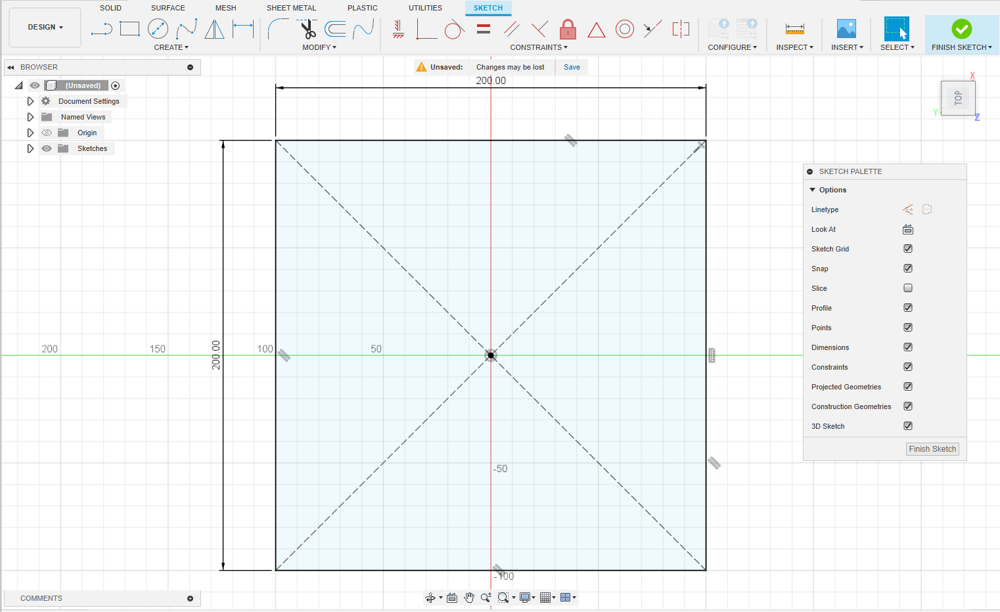
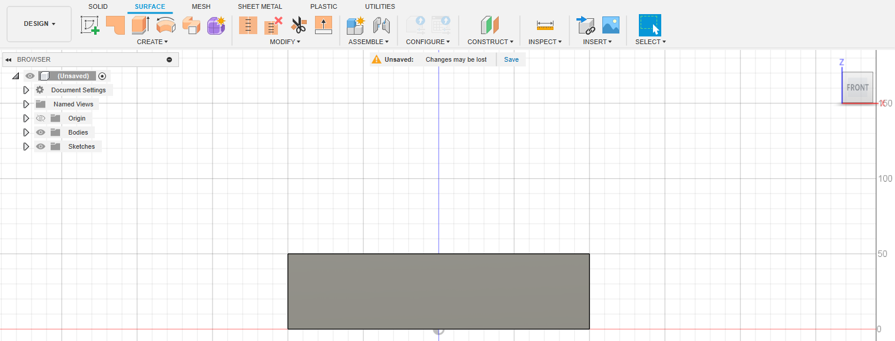
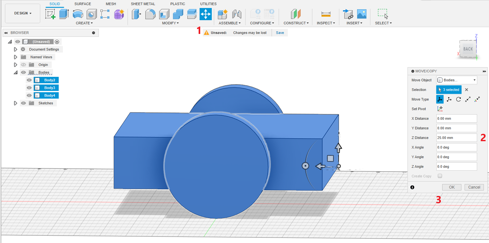
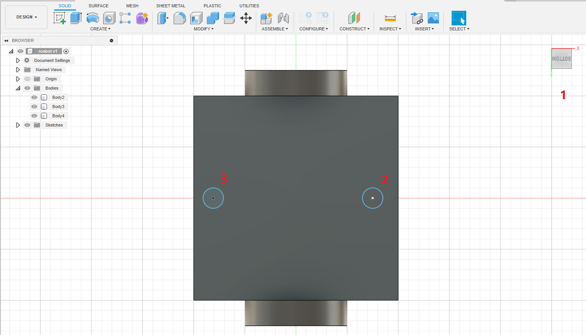
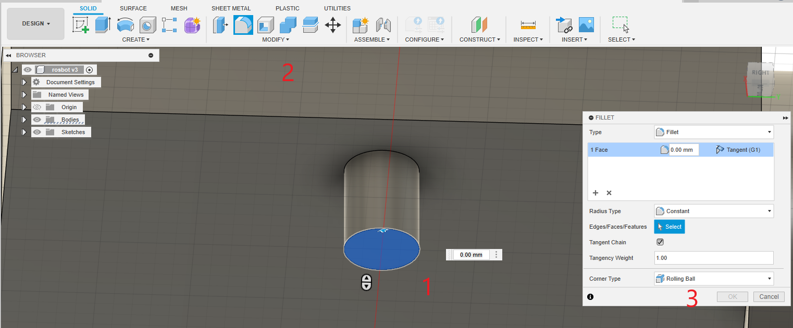
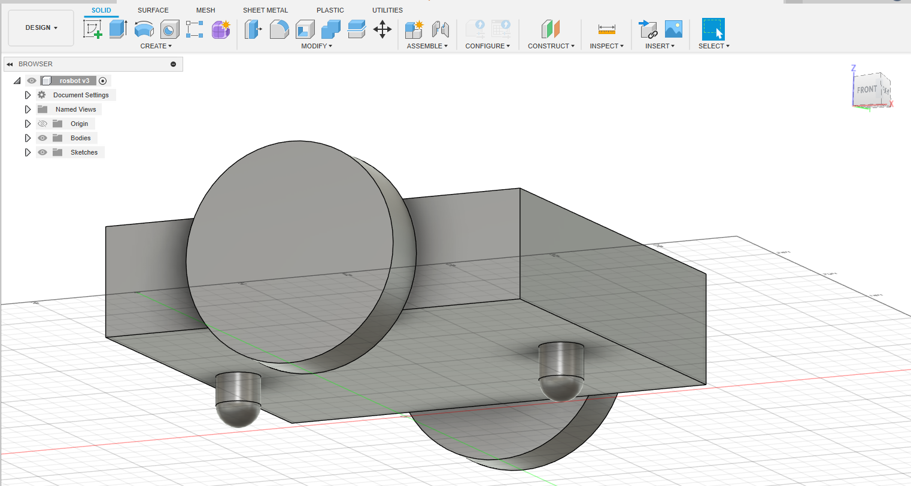
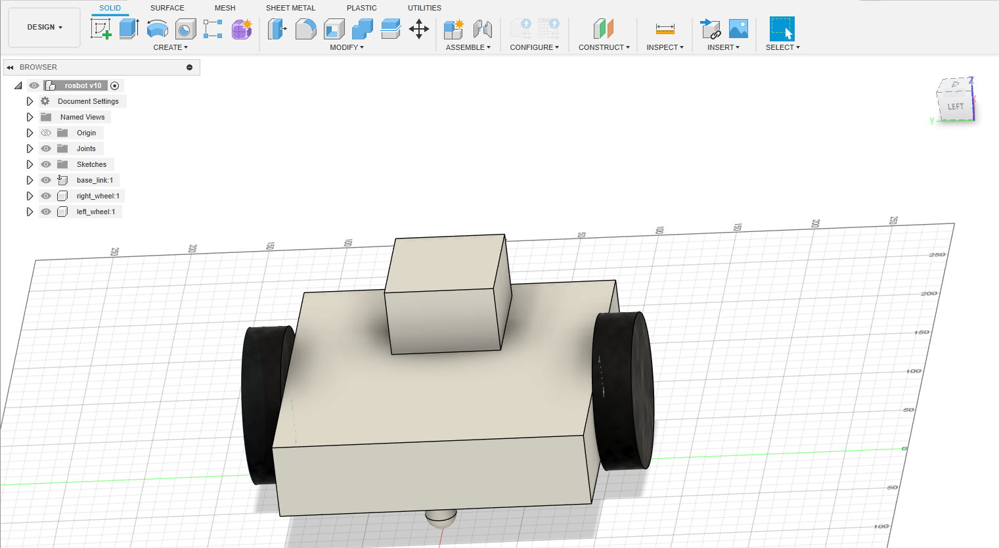
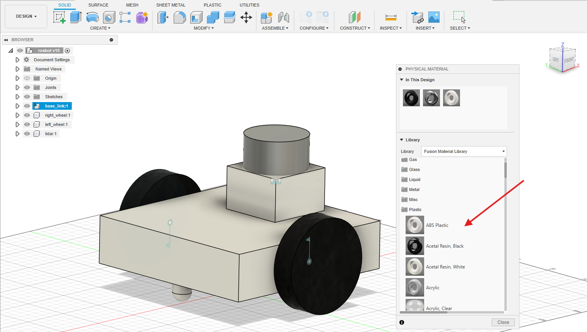
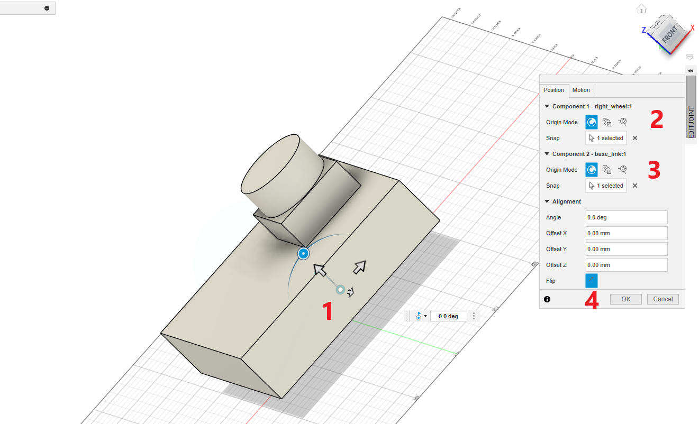

# Introduction to Fusion 360 modeling for ROS 2

In this document, we can see how to model a 2-wheel drive robot in Fusion 360 in order to export into ROS 2 URDF.

Here is the robot model we are going to design.

  

Here are the important steps in the modeling of this robot

# 1) Setting the Design plane for export

We must follow the *right-hand rule* for setting the plane before starting the modeling. 

If we follow this, the exported URDF model will face the *+X-axis*. 
This is the axis we need when we visualize robots in ROS 2.

Here is the design plan we have to set before starting the design.

  

# 2) Sketching Robot Base

After setting the plane, we can start sketching the robot's base. After sketching the plane, we can extrude the plane to create the box.

Select Menu, *SOLID -> Create Sketch*. After pressing this option, it will ask which plane we have to draw the sketch. 

It will show different planes, and choosing the exact plane we want may be confusing. 

We can use the *Shift+ Mouse Center button* to orbit the 3D view to select the same plane we have seen in the first step.

  

After selecting the plane, orbit the 3D scene to make the +X axis always front. 

Now, you can select the *2-point rectangle* from the *SKETCH*. From *Sketch-palette* window on right side, choose *center rectange* option as shown below. 
This option, can draw a rectangle from a center point. 

  

After selecting the plane, orbit the 3D scene to make the +X axis always front. 

Now, you can select the *2-point rectangle* from the *SKETCH*. From the *Sketch-palette* window on the right side, choose the *center rectangle* option as shown below. 
This option allows you to draw a rectangle from a center point.

  

Press the *Tab* key to switch between the square dimensions and enter the dimensions. 
You can give **200 mm** as the width and length for the base_link.

  

After drawing the correct dimensions, you can click the *Finish sketch* button on the right side of the top to complete the sketch.

After completing the sketch, you can click on the top to select the sketch's top area.

  

Now press the key * 'Q' (Menu Solid ->Modify->Press Pull)* to extrude the sketch surface to make a box. Once you press the *'Q'* button, you will see an arrow key that will extrude the sketch to some height. You can give a value of 50 mm as the height.

  

After giving the height as 50 mm, select the *Operation* option from the *Extrude window* on the right side. The *Operation* option we must select is **New Body**. After this option, we can press Ok.

# 3) Adding Wheels to the Robot base

We can add wheels after making the robot's main chassis/base_link.
We must add two active and two passive caster wheels to the chassis.

The following image shows the *Z-X plane*, which shows the side of the chassis in which we have to add wheels.

  

To create wheels, we can start a sketch and extrude it like we did for the chassis.
In the following image, we can see that you have chosen the *Sketch option* and chose a circle with 
center diameter circle, and then choose the center of the chassis, as shown in the following image.
Give a diameter of **100 mm** and press *Finish the sketch*.

  

Now, you can click on the wheel sketch. You may have to press the *Shift* key to
select each segment of the wheel.

Now, press *'Q'* to extrude it and make the distance *25mm* the thickness of the wheel.

The important thing to note is that we have to make the wheel a new body in the operation option in extrude.
This makes a new wheel a new body.

  

We can create the next wheel with the same process we have done with the first wheel.

# 4) Moving Robot to Ground Level

After creating 2 wheels and the base_link, we have 3 independent bodies. 
The next step is to move the entire robot above the design plane. You can compute the distance by measuring it and 
moving the robot using the *Move button*. Make sure you have selected all the 3 bodies before you move. You can roughly put *25 mm* as the *Z value* in the *Move window* to lift the robot from the design floor.

You can find the robot's position in the following image.

  

Here is the side view of the lifted robot.

  

# 5) Adding Caster Wheels to the Base of the robot

After lifting the robot, the next step is to add caster wheels to the robot.
We have to add a caster wheel on the front and back of the robot.
As we already discussed, casters are passive wheels that help the robot balance and distribute weight.

To add two casters, we must create 2 small cylinders on the **bottom** side of the chassis. 

To create a cylinder, we can extrude a circle sketch.
The length of the extrude can be *24 mm*, a few mm less than the robot's height from the ground.

  

Here is how we extrude the caster wheel. Make sure the Operation is a **Joint**, NOT a *New body*. The caster is a part of the chassis.

  

After creating the cylinder on both sides, we can make the bottom face of the cylinder, spherical.

Select the face of the cylinder, and Press *'F'*  or *(Menu Surface->Modify->Fillet)*, and using a mouse, we can create a spherical face from the flat surface.

  

We can do the same operation for both the caster wheels, and the final output will look like the following image. 

  

# 6) Adding Lidar base and lidar to Robot

Once the caster design are completed, next we can add a lidar to the front of the robot. We have to build a fixed platform first.
After putting the base, we can create a cylinder shape on the top of it to replicate a lidar as show below.

You can draw the box with 70 mm(length) x 60 mm(width) x 45 mm (height).

  

After creating the box, we can do a a circle on the top of the box and create a cylinder by extruding the circle.
Make sure, you are creating a new body when you extrude the object.

After creating all bodies, you can rename these bodies into meaniful name like below

  

The chassis has to name as base_link which is mandatory, and you can name 
left and right wheel as same name and you can add name to lidar as well.

# 7) Adding material type and color

After creating the model, we may can goto each body and right click on each body and choose Physical materials.

The Physical material can assign each link with a material properties.

  

Search for ABS plastic for the base link. Just click and drag the material to the link to apply the material.
Choose Rubber black for wheels and laminate blue for lidar.

  

# 8) Converting bodies to Components

After adding the materials properties, we have to convert the individual bodies to Components.
The convertion to bodies to Components is easy to do. 

Here is how we can do it. 

Click on to the Bodies option and choose the option called Components to Bodies
as shown below. Bodies are single shape within a component. A component can hold multiple bodies.
In order to export to URDF, we need to make individual component of the robot.

  

# 9) Assigning Joints to Wheels and Joints

After assigning the materials, we need to assign the joints for connecting 
wheels to base_link. We also has to attach the lidar link to the base_link. This is the most 
important step in the modeling. Without assigning joints, the robot can't able to move.

Here are the steps to assign a joint in Fusion 360. We can first check how to create joint between wheels and base_link.

First, we have to hide the base_link component, and press 'J' (Menu Solid->Assemble->Joint) to create a new joint.
After invoking the joint option, we have to provide the components (link) which is in the joint.

We can see how to create a revolute joint between the base_link the two wheels. 
In order to create a joint, we need to 2 components, the first components should be the wheel and the second will be the base_link.

We have to hide the base_link first, and click on the center of the wheel which is attached to the base_link.

  

After click on the center on the wheel, we can see a coordinate on the wheel, next, we can hide the wheels and attach the frame in the base_link.

  

Once it is done, you can press Motion Tab in Edit Joint option to select the type of joint.

  

The revolute joint is what we need for the wheels, so select it and you can preview the motion of the joint as well.

After setting one joint, you can do the same for next wheel as well.

For lidar link, we have to create a rigid link between lidar and base_link.

Congratulation, you have done with the modeling part of the robot. Now we can export the model to URDF.

