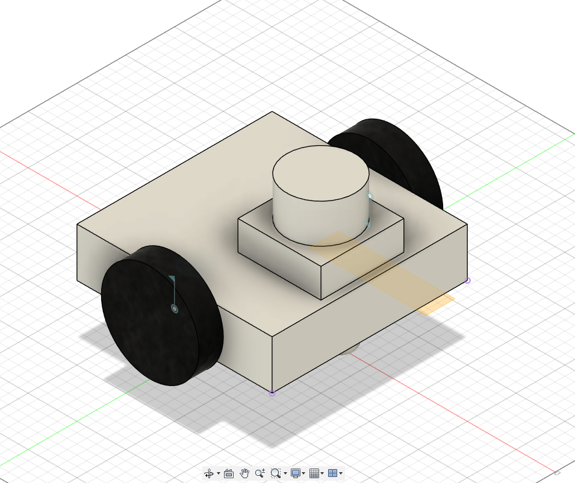
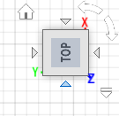
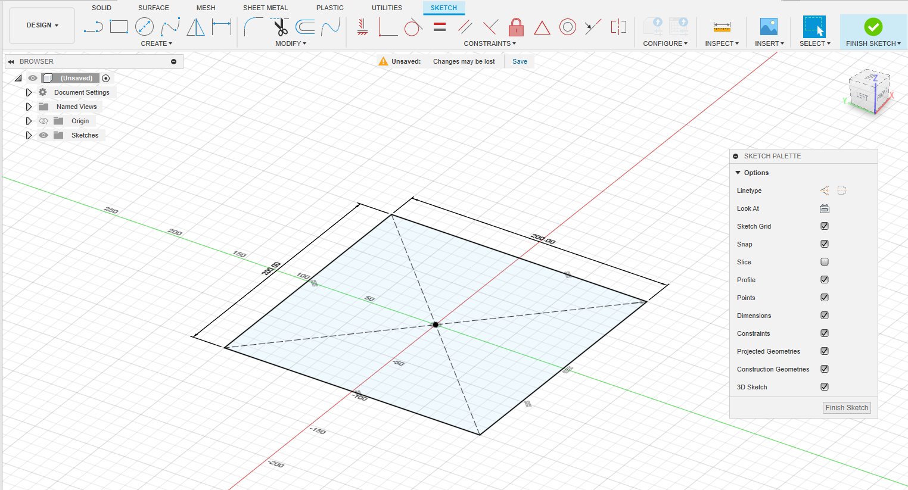
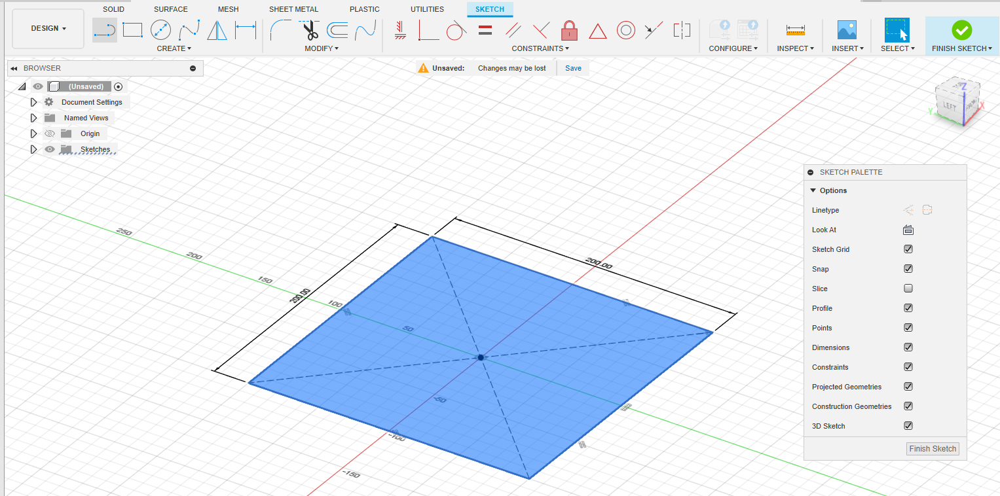
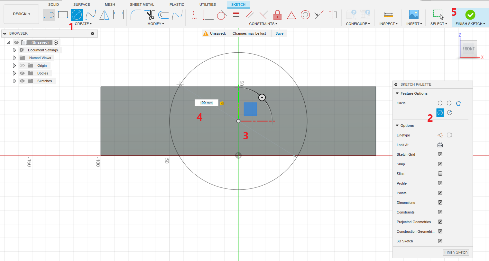

# Introduction to Fusion 360 modeling for ROS 2

In this document, we can see how to model a 2 wheel drive robot in Fusion 360 in-order to export into ROS 2 URDF.

Here is the robot model we are going to design

  

Here the important steps in the modeling of this robot

# 1) Setting the Design plane for export

We must follow the right-hand rule for setting the plane before starting the modeling. If we follow this, the exported URDF model will face the + X-axis.

Here is the design plane we have to set before start the design.

  

# 2) Sketching Robot Base

After setting the plane, we can start sketching the base of the robot. After sketching the plane, we can extrude the plane to create the box.

Select Menu, SOLID -> Create Sketch. After pressing this option, it will ask which plane we have to draw the sketch. It will show different planes and choosing the exact plane we want may be confusing at first time. We can use Shift+ Mouse Center button to orbit the 3D view to select the same plane we have seen in the first step.

  

After selecting the plane, orbit the 3D scene to make the +X axis always front. 

Now, you can select the 2-point rectangle, and from sketch-palette window on right side, choose center rectange option as shown below. This option, can draw a rectangle from a center point. 

After selecting, center point option, go to the origin of the plane and click the mouse and you can start drawing the rectangle.

  

When you start drawing the square, you can find the dimension of the square, you can use Tab key to toggle the dimension. You can edit the dimensions in the box. For this model, you may can give 200 mm for each side.

  

  

After drawing giving the correct dimensions, you can the click the finish sketch button on the right side top to complete the sketch.

After completing the sketch, you can click on the top of the sketch for selecting the top area of the sketch.

  

Now press the key 'Q' (Menu Solid ->Modify->Press Pull), to extrude the sketch surface to make a box. Once you press the 'Q' button you can see an arrow key to extrude the sketch to some height. You can give a values as 50 mm as the height.

  

After giving the height, select Operation option from Extrude window on right side. The Operation option we have to select is New Body. After this option, we can press Ok.

# 3) Adding Wheels to the Robot base

After making the main chassis of the robot, we can now add wheels to the chassis.
We have to add two active wheels and two passive caster wheels to the chassis.

The following image shows Z-X plane, which shows the side of the chassis in which we 
have to add wheels.

  

Now, to create wheels, we can start a sketch and extrude it like we did it for the chassis.
In the following image, we can see have chose Sketch option, and chose circle with 
center diameter circle and then choose the center of chassis like the following image.
Give diameter as 100 mm and finish the sketch.

  

Now, you can click on the wheel sketch. You may have to press Shift key to
select each segment of the wheel.

Now, press 'Q' to extrude it and make the distance 25mm as thickness of the wheel.
Important think to note is, we have to make the wheel as a new body in the operation option in extrude.
This make a new wheel as a new body.

  

We can create the next wheel with the same process we have done with the first wheel.

# 4) Moving Robot to Ground Level

After creating 2 wheels and the chasis, totally, we have 3 bodies. 
The next step is to move the entire robot above the design plane. You can compute the distance by measuring it and you can
move the robot using Move button. Make sure you have selected all the 3 bodies before you move. You can roughly put 25 mm as Z value in Move window to lift the robot up from the design floor.

You can find the robot position like the following image.

  

# 5) Adding Lidar base and lidar to Robot

# 6) Adding Caster Wheels to the Base of the robot

# 8) Adding material type and color

# 9) Assigning Joints to Wheels

# 10) Exporting to URDF